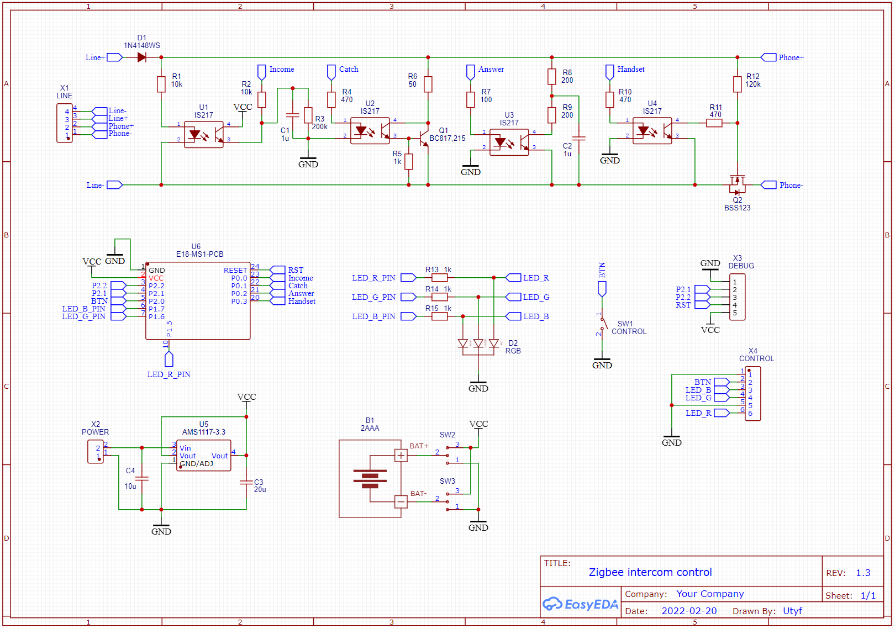
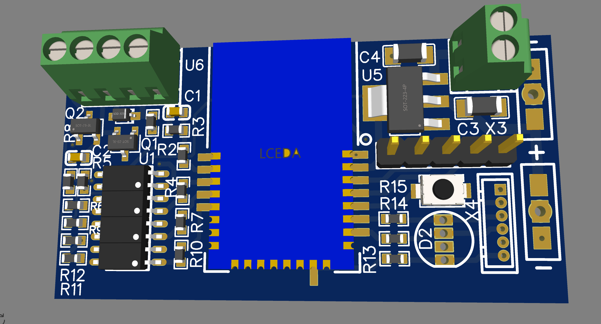

# Zintercom

## Firmware options
Each firmware version has 6 variants.
For different zigbee modules and power supply.

- EndDevice - for battery power
- Router - for external power

- PA1 - for E18-MS1PA1 module
- PA2 - for E18-MS1PA2 module
- no suffix - for E18-MS1 module

## Using battery as power supply
The firmware for the battery has the following differences.
- The device is mostly asleep.
- Wakes up once every 30 minutes (parameter - time_report) and sends a report.
- Zigbee commands are only executed when the device wakes up.
- RGB lights up for 2 seconds after changing the mode with the button.
- When the "no sound" mode is turned on, the constant consumption is 3 mA. In this mode AAA batteries will last 1-2 months.

## RGB Software
Release 2.0.0 support new RGB hardware and legacy hardware with one Led.

## RGB Hardware
Schematics and PCB - https://oshwlab.com/Utyf/zcom

### Files to reproduce
* [Gerbers](https://github.com/diyruz/Zintercom/tree/master/hardware)  
* [Firmware](https://github.com/diyruz/Zintercom/releases)  
