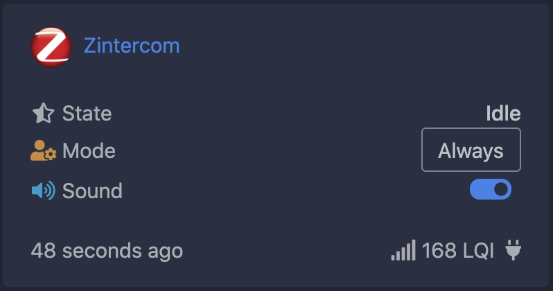
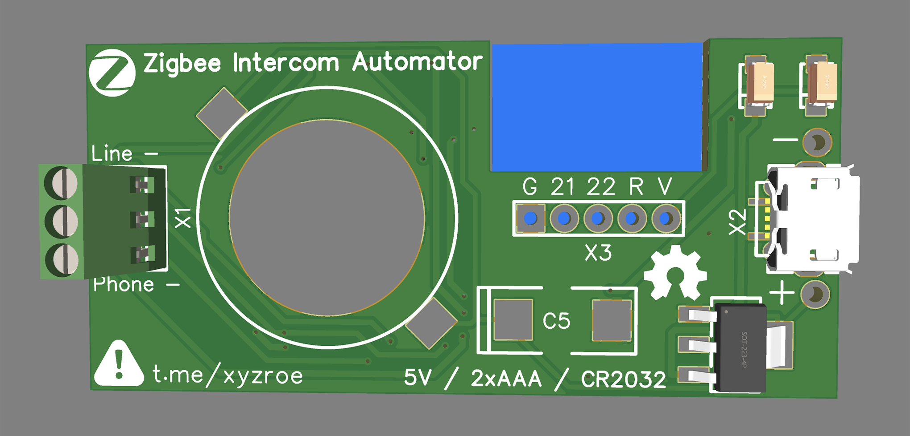
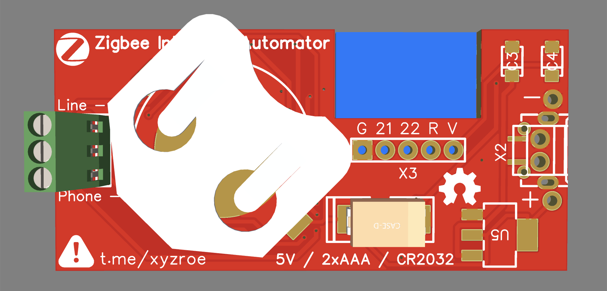

# Zintercom  
## Zigbee Intercom Automator
This device is designed to control the matrix intercom using Zigbee

Using zigbee2mqtt you can:
1. Receive notification when the intercom rings. (also support **direct bind**)
2. Mute the sound on the intercom handset.
3. Automatically or manually open the door or hang up when the intercom rings. 

There are 4 work modes:  
Never - ordinary work mode, use handset to control  
Once - one time open door when intercom rings  
Always - open door when intercom rings  
Drop - hangs up all intercom rings, right after start  

You can change the operating mode with z2m or by pressing the button.  
After pressing the button, the LED will flash.  
The number of flashes indicates the current operating mode.  

### How to join
Reset to FN by reboot device 5 times with interval less than 10 seconds.  
Reset to FN by press and hold BTN for 5 seconds.  

LED will flash during reset.  

### How to add device into zigbe2mqtt
Use [external converters](https://www.zigbee2mqtt.io/information/configuration.html#external-converters-configuration) feature

Converter file located [here](./converters/DIY_Zintercom.js)  

### Schematic

### PCB size  

`57.5mm x 27.3mm`  

### DC Power  

Support `router` and `end device` modes.  
Install `E18-MS1PA1`, `E18-MS1PA2` or `E18-MS1-PCB`.  

### Battery Power  

Support only `end device` mode.  
Install `E18-MS1-PCB` only!  

