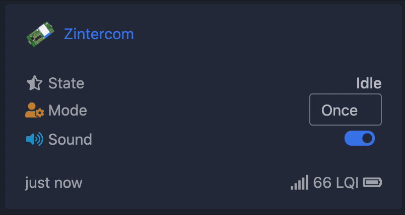
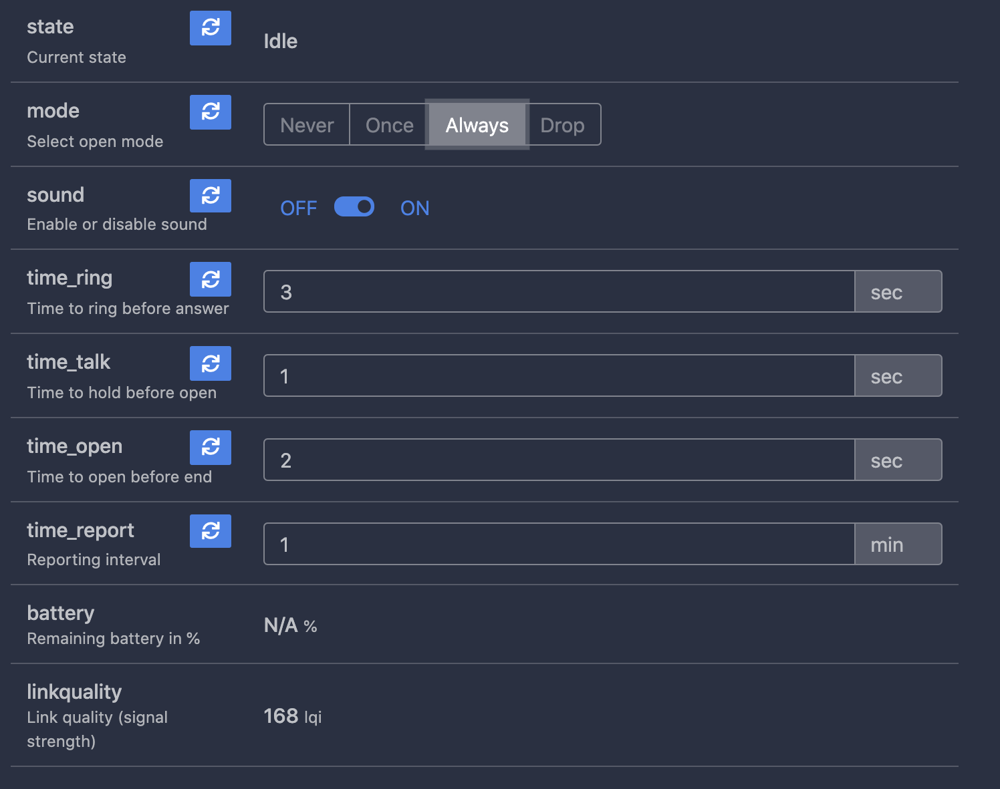
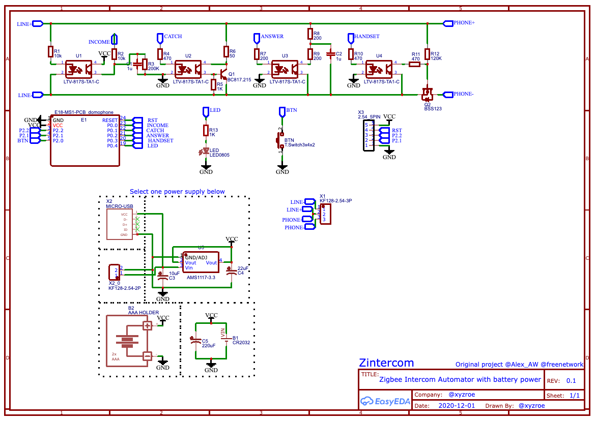
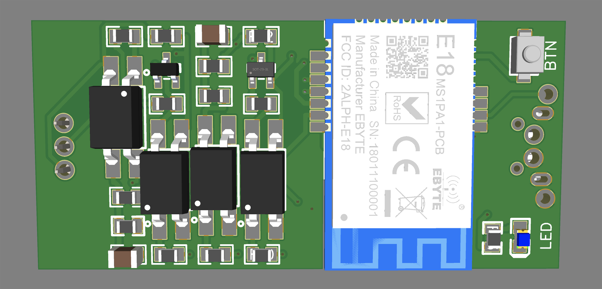
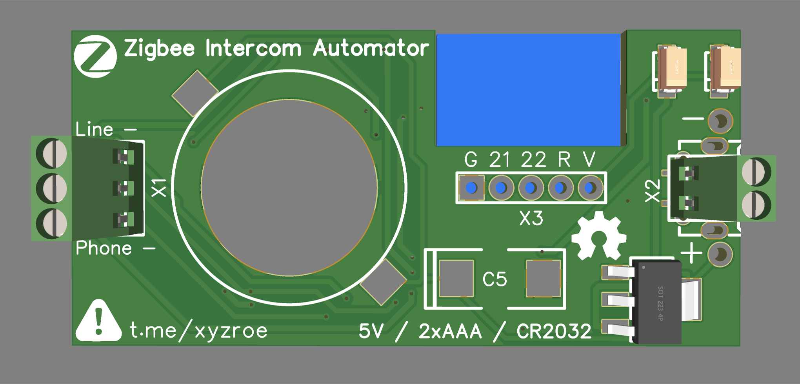
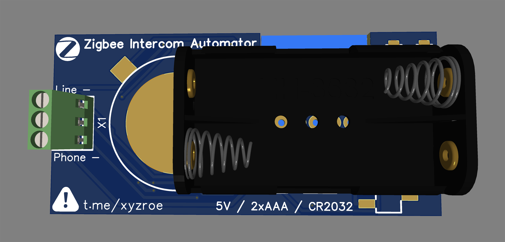

# Zintercom  
##### Zigbee Intercom Automator  
This device is designed to control the matrix intercom using Zigbee.

Using zigbee2mqtt you can:
1. Receive notification when the intercom rings. (also support **direct bind**)
2. Mute the sound on the intercom handset.
3. Automatically or manually open the door or hang up when the intercom rings.

There are 4 work modes:  
1. `Never` - ordinary work mode, use handset to control  
2. `Once` - one time open door when intercom rings  
3. `Always` - open door when intercom rings  
4. `Drop` - hangs up all intercom rings, right after start  

You can change the operating mode with z2m or by pressing the button.  
After pressing the button, the LED will flash.  
The number of flashes indicates the current operating mode.  

### How to join
Reset to FN by reboot device 5 times with interval less than 10 seconds.  
Reset to FN by press and hold BTN for 5 seconds.  

LED will flash during reset.  

     

### How to add device into zigbe2mqtt
Use [external converters](https://www.zigbee2mqtt.io/information/configuration.html#external-converters-configuration) feature

Converter file located [here](./converters/DIYRuZ_Zintercom.js)  

  

### Schematic

### PCB size  

`57.5mm x 27.3mm`  

### DC Power  

Support `router` and `end device` modes.  
Install `E18-MS1PA1`, `E18-MS1PA2` or `E18-MS1-PCB`.   

  

### Battery Power  

Support only `end device` mode.  
Install `E18-MS1-PCB` only!  

Do not turn off `sound` because it turns U2 forever, which will drain the battery much faster.

Since the device is in sleep mode, it cannot receive commands.  
But you have the ability to set the button mode or at the time of the call.  

If any commands are in the coordinator's queue, they will be executed after a button is pressed or a call is received.

##### The mode set by the Zigbee command `overwrites` the mode set by the button.

### Binding
The device supports direct binding of an incoming call to the onOff cluster.  

For example, you can turn on the light while a call comes to the intercom, for notification in mute mode.

### Files to reproduce
* [Gerbers and BOM](https://github.com/diyruz/Zintercom/tree/master/hardware) by [xyzroe](https://t.me/xyzroe)  
* [Firmware](https://github.com/diyruz/Zintercom/releases) by [xyzroe](https://t.me/xyzroe)  

### Inspired by
The original scheme of the intercom opener by [Alexander Vaidurov](https://easyeda.com/Alex_AW/domofon-with-battery)  
Various hardware solutions by [Jager](https://modkam.ru)  
Firmware for different Zigbee devices by [Anonymous](https://github.com/nurikk/)  
